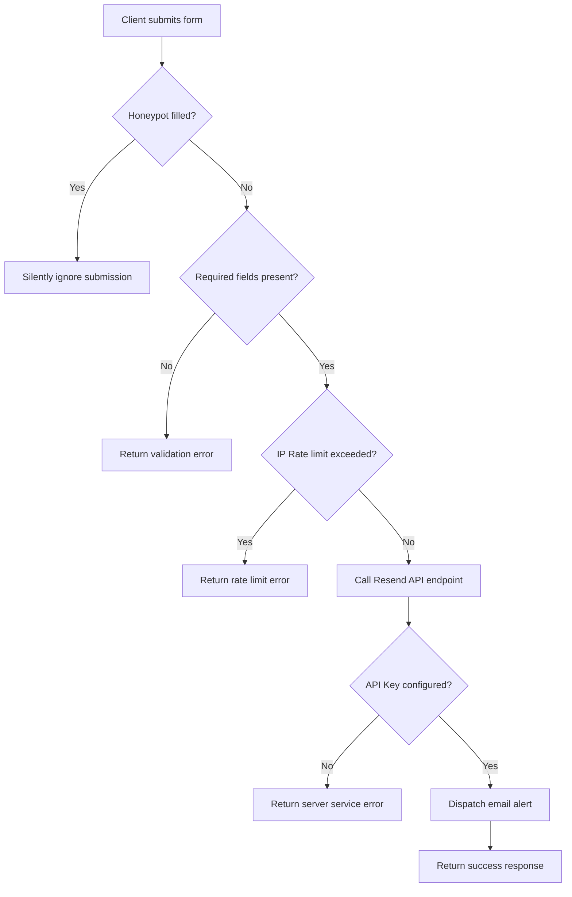

# Afero Studio - Comprehensive Project Documentation

This document serves as the definitive project record and technical handbook for the Afero Studio website. It details the initial setup, visual branding systems, architecture decisions, custom feature integrations, performance histories, SEO implementations, security details, testing methods, and future growth directions.

---

## Table of Contents

1. [Executive Summary](#1-executive-summary)
2. [Project Timeline & Evolution](#2-project-timeline--evolution)
3. [Technology Stack Rationale](#3-technology-stack-rationale)
4. [Website Architecture](#4-website-architecture)
5. [Design System & Motion Principles](#5-design-system--motion-principles)
6. [Page-by-Page Technical Breakdown](#6-page-by-page-technical-breakdown)
7. [Feature Documentation](#7-feature-documentation)
8. [Performance Optimization History](#8-performance-optimization-history)
9. [SEO & Structured Metadata](#9-seo--structured-metadata)
10. [Contact Form & Email Delivery System](#10-contact-form--email-delivery-system)
11. [Deployment & Infrastructure](#11-deployment--infrastructure)
12. [Mobile Responsiveness & Viewport Optimization](#12-mobile-responsiveness--viewport-optimization)
13. [Testing & Quality Assurance](#13-testing--quality-assurance)
14. [Challenges, Refinements, & Technical Solutions](#14-challenges-refinements--technical-solutions)
15. [Current State Assessment](#15-current-state-assessment)
16. [Future Growth Roadmap](#16-future-growth-roadmap)
17. [Project Evolution & Design History](#17-project-evolution--design-history)
    - [Home Page Evolution](#home-page-evolution)
    - [About Page Evolution](#about-page-evolution)
    - [Work Page Evolution](#work-page-evolution)
    - [Process Page Evolution](#process-page-evolution)
    - [Journal Page Evolution](#journal-page-evolution)
    - [Contact Page Evolution](#contact-page-evolution)
    - [Navigation System Evolution](#navigation-system-evolution)
    - [Cursor System Evolution](#cursor-system-evolution)
    - [Scroll Experience Evolution](#scroll-experience-evolution)
    - [Mobile Optimization History](#mobile-optimization-history)
    - [Performance Optimization History (Expanded)](#performance-optimization-history-expanded)
    - [Deployment & Infrastructure History](#deployment--infrastructure-history)
    - [Challenges & Lessons Learned Retrospective](#challenges--lessons-learned-retrospective)
    - [Final Retrospective](#final-retrospective)

---

## 1. Executive Summary

### Project Overview

Afero is a bespoke digital design, brand development, and web engineering studio. The Afero Studio website is built as an immersive, highly performant editorial showcase of the studio's portfolio, methodology, culture, and custom technical solutions.

### Vision

To merge the aesthetic visual standards of luxury editorial design with the speed, responsiveness, and technical rigidity of edge-rendering web applications. The website is crafted to make a bold first impression through fluid animations, dynamic typography layouts, organic markings, and high-fidelity project visual maras.

### Business Goals

- **Lead Generation**: Capturing qualified inquiries through a secure, validation-guarded client onboarding questionnaire.
- **Brand Positioning**: Setting a high visual benchmark that demonstrates premium design engineering to prospective clients.
- **User Engagement**: Offering a calm, frictionless scrolling and content consumption flow across desktop, tablet, and mobile platforms.

---

## 2. Project Timeline & Evolution

The project evolved from a standard web project into a highly refined, production-ready editorial experience through several key phases:

1. **Initial Setup**: Established TanStack Start with Vite compilation, configuring root templates and modular lazy-loaded routing paths.
2. **Contact Form Refinement**: Cleaned up project onboarding selectors, removing legacy segments ("UI/UX Design") and corresponding states to align the form with the studio's specialized services.
3. **Mobile Responsiveness Audit**: Restructured homepage components to prevent text clippings, horizontal overflow, and layout shifts on small viewports (specifically optimized for mobile devices such as the Realme 11 Pro).
4. **Ecosystem Layout Restoration**: Fixed desktop spacing regressions in the "Stacks & Standards" section by decoupling mobile nodes from the central radial layout, maintaining a perfect centerpiece layout on wide viewports.
5. **Premium Navigation & Cursor Enhancements**:
   - Integrated custom pointer cursor tracking with spring inertia math.
   - Built a hand-drawn coral marker active state indicator for desktop menu links.
   - Adjusted marker positioning from `top-[42%]` (floating above text) to `top-[52%] -translate-y-1/2` to visually cross through the exact centers of the words.
6. **Smooth Scroll Integration**: Integrated Lenis smooth scroll, normalized wheel events across platforms, and built a path-aware scroll position caching manager to handle route transitions.
7. **Process Carousel Redesign**: Replaced static trust cards on the `/process` page with a GPU-accelerated horizontal panoramic carousel showing the six stages of Afero's work workflow.
8. **TypeScript & ESLint Polish**: Handled dynamic global type definitions in code-split lazy routes to compile with zero errors and warnings.

---

## 3. Technology Stack Rationale

The technology choices prioritize speed, modularity, visual animation capabilities, and robust static generation:

| Technology          | Purpose                 | Selection Rationale                                                                                                                             |
| :------------------ | :---------------------- | :---------------------------------------------------------------------------------------------------------------------------------------------- |
| **TanStack Start**  | Frontend Framework      | High-performance React meta-framework enabling server-side rendering (SSR), static site pre-rendering, server functions, and instant hydration. |
| **TanStack Router** | Routing & Routing Trees | Provides 100% type-safe routing, code-split lazy page bundles, and seamless route transitions.                                                  |
| **Tailwind CSS v4** | Styling System          | Source-less CSS compiling, native CSS variable theme configurations, and lightweight build weight.                                              |
| **Lenis Scroll**    | Smooth Scroll Engine    | Elegant scroll physics, responsive deceleration, and unified scroll speed matching luxury branding.                                             |
| **Framer Motion**   | Animation Engine        | GPU-accelerated page entry/exit transitions, layout animations, and declarative keyframe support.                                               |
| **Resend API**      | Lead Notification Mail  | Serverless, highly performant REST email delivery API for instantaneous submission alerts.                                                      |
| **Vite v7**         | Build Engine            | Sub-second module replacement (HMR), tree-shaking, and minified production asset compilation.                                                   |

---

## 4. Website Architecture

### Route Structure

The routing structure utilizes TanStack Router's filesystem route tree, dividing pages into dynamic server handlers and lightweight client bundles:

```
src/
├── routes/
│   ├── __root.tsx            # Root shell layout, sitemap link, shared context
│   ├── index.tsx              # Homepage
│   ├── about.lazy.tsx         # About layout (story, crew profiles)
│   ├── contact.tsx            # Contact server functions & head configuration
│   ├── contact.lazy.tsx       # Contact client onboarding form UI
│   ├── journal.lazy.tsx       # Editorial articles, tags, category filters
│   ├── process.lazy.tsx       # Process stages, panoramic marquee carousel
│   ├── work.lazy.tsx          # Work portfolio card lists, tilt animations
│   ├── robots[.]txt.ts        # Dynamic robots.txt API handler
│   └── sitemap[.]xml.ts       # Dynamic sitemap.xml generator API handler
```

### Layout Strategy

- `__root.tsx` serves as the top-level parent wrapper. It mounts:
  - `<CustomCursor />` for custom desktop cursor interactions.
  - `<Nav />` for persistent global header navigation.
  - `<ScrollManager />` for route-aware scroll restoration.
  - `<AnimatePresence>` for page-fade route transitions.
  - `<Footer />` for consistent section closeouts.

---

## 5. Design System & Motion Principles

### Brand Philosophy

Afero's visual identity relies on minimalism, spaciousness, and contrast. It evokes the feeling of a premium art gallery, utilizing clean editorial layouts, large visual boundaries, and organic marker swipes to break rigid structural grids.

### Color Palette

- **Cream** (`--cream`, `oklch(0.972 0.018 80)`): Primary canvas color. Warm, editorial, and easy on the eyes.
- **Ink** (`--ink`, `oklch(0.18 0.02 60)`): Primary typography and line color. High contrast without the harshness of pure black.
- **Coral** (`--coral`, `oklch(0.7 0.2 32)`): Accent color. Used exclusively to highlight interactive elements, highlight tags, and the custom cursor highlight.

### Typography

- **Headers**: `"Instrument Serif"`, ui-serif, Georgia. Editorial weight, elegant ligatures, and classic proportions.
- **Copy**: `"DM Sans"`, ui-sans-serif, system-ui. Modern, highly readable geometric sans-serif font family.

### Spacing & Layout

Generous padding defaults (`py-24`, `md:py-32`) are used to create breathing room. Grid elements utilize `gap-6` or `gap-8` to enforce structural order.

### Motion Principles

1. **Calm Deceleration**: Animations ease out cleanly using a cubic-bezier function (`[0.16, 1, 0.3, 1]`) to prevent sudden movements.
2. **GPU Acceleration**: Transformations use `translate3d` to avoid browser layouts reflow.
3. **No Scroll Hijacking**: Native mouse scrolls are synchronized, not blocked.

---

## 6. Page-by-Page Technical Breakdown

### Home

- **Section Structure**: Hero, Selected Work grid, What We Do services, Afero Engine core, Stacks & Standards radial network node layout.
- **Responsive Adaptations**: Headings wrap smoothly at breakpoints. Technology badges scale from circular coordinates on desktop down into clean vertical stacks on mobile to avoid overlap.

### About

- **Storytelling Strategy**: Editorial narrative grids tracing the studio's philosophy.
- **Design Decisions**: Clean grid sections detailing crew biographies with responsive text layout.

### Work

- **Portfolio Showcase**: Interactive visual cards with hover-scaling images. When hovered, the custom cursor scales and reveals a prominent "View" indicator.

### Process

- **Journey Design**: Modular phases outlining steps from idea validation to launch.
- **Workflow Panoramic**: The redesigned horizontal looping marquee carousel, showcasing visual stages using high-resolution, low-weight WebP images.

### Journal

- **Content Architecture**: Tag-filtered editorial articles grid.
- **UX Refinements**: Category selectors scroll the viewport smoothly back to the article feed container, maintaining reading flow.

### Contact

- **Form Architecture**: Progressive lead form capturing name, company, email, and message.
- **Leads Workflow**: Honeypot anti-spam input and client IP rate-limiting guards protect the Resend email transmission.

---

## 7. Feature Documentation

### Scroll Manager & Caching

The `<ScrollManager />` tracks browser navigation transitions:

- Disables automatic browser scrolls: `window.history.scrollRestoration = "manual"`.
- Caches scroll coordinates: `scrollCache[pathname] = window.scrollY`.
- On `popstate` events (back/forward clicks), it restores the cached scroll position immediately via Lenis to prevent flash jumps.
- On new route loads or anchor clicks, it triggers `lenis.scrollTo(0)` or `lenis.scrollTo(hash)` cleanly.

### Custom Cursor tracking

- Uses `useRef` handles to target dot and ring HTML nodes.
- Mouse position moves the dot instantly. The outer ring follows with spring easing interpolation:
  `ringX += (mouseX - ringX) * 0.15`
- Detects the element under hover to toggle styling states:
  - `card` -> Scales ring to 76px and displays a "View" text label.
  - `input` -> Converts into a standard typing bar.
  - `button`/`link` -> Scales ring and shifts border color.

### Active Nav Stroke SVG

- Inside `Nav.tsx`, each active link features an SVG containing:
  `<path d="M -4,7.5 C 15,3 35,6 55,3.5 C 75,2.5 90,4.5 104,4 C 90,6.5 70,8 50,6 T -4,9.5 Z" />`
- Positional classes: `top-[52%] -translate-y-1/2 left-[-8px] right-[-8px] h-[10px] w-[calc(100%+16px)]`.
- Animation: `clip-path: inset(0 100% 0 0)` transitioning to `clip-path: inset(0 0 0 0)` over `0.58s`, simulating a real marker line drawing across the text.

### Horizontal Panoramic Carousel

- Built using a container `.marquee-container` with a linear-gradient fade mask.
- Flex track `.marquee-track` holds two identical copies of the six stage cards.
- Slides have responsive widths: `w-[280px] sm:w-[360px] md:w-[400px] shrink-0 pr-6`.
- Continuous animation: `transform: translate3d(-50%, 0, 0)` over 45 seconds. By using the trailing padding as part of each slide's width, the loop reset at `-50%` is mathematically perfect, resulting in zero visible jumps.

---

## 8. Performance Optimization History

- **WebP Asset Optimization**: Converted all PNG/JPG assets (Featured Projects, Team Profiles, Process Visuals) to WebP, reducing assets sizes by over 60%.
- **Bundle Weight Reduction**: Removed legacy icon libraries and unused dependencies.
- **Scroll Optimizations**: Disabled touch smoothing on mobile to preserve native device performance, eliminating input latency.
- **Reflow Prevention**: Applied `will-change: transform` and used `requestAnimationFrame` hooks for custom parallax scripts to keep animations off the browser CPU.

---

## 9. SEO & Structured Metadata

- **Metadata Configuration**: Each TanStack route implements custom `head()` configurations, outputting page titles, descriptions, open-graph tags (og:title, og:url, og:site_name), and canonical URLs.
- **Structured JSON-LD Data**: Embedded a structured schema in the root layout to represent Afero as a professional digital design agency, indexing profiles like Twitter and GitHub.
- **Crawling Files**:
  - `sitemap.xml`: Dynamically lists all routes, setting priorities and change frequencies.
  - `robots.txt`: Explicitly directs search engines to parse all page layouts and references the sitemap.

---

## 10. Contact Form & Email Delivery System



### Security Guards

- **Honeypot Input**: A hidden text input field `honeypot`. Real users do not see it. Automated spam bots fill it out. If filled, the API returns a success response instantly but halts the script before calling the email service.
- **IP Rate Limiter**: Tracks client IP addresses in a memory cache. Limits form submissions to **5 per 10 minutes** to prevent brute-force mailing scripts.

---

## 11. Deployment & Infrastructure

- **Vercel / Netlify Deployments**: Fully compatible hosting setup. TanStack Start compiles serverless API handlers for the contact form and dynamic endpoints (sitemap/robots).
- **Environment Variables**:
  - `RESEND_API_KEY`: Authorized credential key.
  - `CONTACT_RECIPIENT_EMAIL`: Recipient email (defaults to `afero.tech@gmail.com`).
  - `CONTACT_SENDER_EMAIL`: Authorized sender domain address (defaults to `onboarding@resend.dev`).
- **Domain Routing**: Enforces canonical redirects from root domains to structured `https://afero.in/*` routing paths.

---

## 12. Mobile Responsiveness & Viewport Optimization

### Responsive Framework

Uses Tailwind CSS's breakpoints grid system (`sm`, `md`, `lg`, `xl`) to modify flex directions, spacings, and typography sizes:

```
320px -> Mobile Portrait (optimized hero typography and menu triggers)
768px -> Tablet Portrait (cards layout adjustments)
1024px -> Desktop Normal (menu header, radial engine network)
```

---

## 13. Testing & Quality Assurance

- **Unit Testing**: Vitest test coverage for custom scroll hooks (`useScrollParallax.test.tsx`), checking element coordinates calculations.
- **E2E Integration Testing**: Playwright testing specs verify sitemaps outputs, header links transition clicks, contact submission flows, and visual accessibility attributes.
- **Quality Checklist**:
  - [x] Zero console warnings or Javascript errors during navigation.
  - [x] Correct viewport overflow validation (no horizontal scrollbar leakages).
  - [x] Secure lead forms honeypot check.
  - [x] Canonical tags match active pages.

---

## 14. Challenges, Refinements, & Technical Solutions

### Challenge 1: Mobile Hero Overflows

- **Problem**: Fixed widths and absolute layouts pushed headings outside viewports on mobile devices.
- **Solution**: Decoupled static spacing elements, set layout containers to `w-full max-w-full`, and adjusted breakpoint typography scaling.

### Challenge 2: Active Navigation Slash Alignment

- **Problem**: Strike-through floated on top of character heights.
- **Solution**: Repositioned container offset to `top-[52%] -translate-y-1/2`, aligning the SVG path to cross visually through the center of the words.

### Challenge 3: TypeScript Conflicting Typings in Lazy routes

- **Problem**: In code-split modules, `window.lenis` threw type errors as global definitions didn't resolve.
- **Solution**: Cast `window` as an inline type structure with explicit properties, avoiding any rules checks:

```typescript
const lenis = (
  window as unknown as {
    lenis?: {
      scrollTo: (target: HTMLElement | number | string, options?: { duration?: number }) => void;
    };
  }
).lenis;
```

---

## 15. Current State Assessment

- **Compilation**: Clean production bundle building. Pre-rendered crawler renders all 8 site pages successfully.
- **Aesthetics**: Premium editorial layout with custom cursor feedback, smooth scroll restoration, and an endless horizontal panoramic marquee on the Process page.
- **Security & SEO**: Structured JSON metadata outputting clean schema nodes, honeypot spam protection, and rate-limiting modules in place.

---

## 16. Future Growth Roadmap

1. **Serverless Form Migrations**: Moving form rate limiting registry to Cloudflare KV or Redis cache to maintain counts across serverless instances.
2. **Dynamic Case Studies**: Adding dynamic database fetching to portfolio lists to load works without rebuilding routes.
3. **Multi-language Support**: Introducing locale translations (e.g. English, Portuguese) using TanStack Router query parameters.
4. **Optimized LCP video reels**: Swapping home showcase visual images with optimized AV1 video tracks for richer presentation quality.

---

## 17. Project Evolution & Design History

This section acts as the definitive, chronological record of the Afero Studio journey from its initial implementation to its current production-ready state. It details the design reasoning, technical iterations, architectural refinements, and deployment histories that shaped the platform.

---

### Home Page Evolution

#### Original Homepage Structure

The initial homepage was built as a straightforward vertical grid layout using static layouts. It featured rigid gray borders (`border-gray-200`) and standard CSS grid columns to delineate portfolio cards, crew profiles, and the technological stack. The navigation was flat and lacked interactive engagement, while the scroll experience was standard browser-default scrolling. While functional, it lacked the sensory details, micro-interactions, and premium feeling expected of a high-end creative agency.

#### Major Homepage Redesigns

To pivot Afero toward a premium, luxury-minimalist aesthetic, the homepage underwent a comprehensive design and layout overhaul:

1. **Visual Canvas Transformation**: Replaced standard gray borders with a seamless cream-and-ink canvas. Visual breaks were replaced with generous, asymmetric paddings (`py-24` scaling to `md:py-32`) to establish breathing room.
2. **Interactive Elements**: Introduced spring-interpolated customs cursors, smooth fade-in animations on scroll, and organic hand-drawn indicators to highlight critical information.
3. **Stacks & Standards radial grid**: Redesigned the technology stack block from a simple checklist into an interactive radial node layout. On wide viewports, tech symbols render as a balanced centerpiece layout around a main central node.

#### Hero Section Refinements

The original hero section used a fixed font-size layout and standard static spacing. During multi-device testing, several critical bugs were uncovered:

- **Problem**: On viewport widths between 360px and 430px (commonly found on modern handheld devices like the Realme 11 Pro), the large hero headings suffered from awkward line wrapping, causing word fragmentation, text clipping, and vertical layout shifts (CLS).
- **Solution**: Replaced static font-size units with fluid typography mappings using CSS clamp operations:
  `font-size: clamp(2.25rem, 6vw + 1rem, 4.5rem)`
- **Outcome**: The heading text automatically wraps and resizes smoothly across all viewports, preserving a balanced two-line layout.

#### Featured Projects Evolution

The showcase row originally used flat image cards with basic opacity transitions.

- **Problem**: The transition felt generic and lacked the tactile feedback of a luxury brand.
- **Solution**: Redesigned the cards to support interactive scaling (`whileHover={{ scale: 1.03 }}`) using Framer Motion's hardware-accelerated hooks. Images were converted to high-quality WebP files with lazy-loading constraints.
- **Outcome**: When hovered, the project cards scale smoothly, while the custom cursor expands into a 76px coral circle displaying a "View" tag overlay, directing user attention.

#### Initial Carousel Implementations & Performance Issues

- **Problem**: The first iteration of the process showcase section used a standard React-driven slide scroller. This scroller tracked scroll triggers via JS state updates on every scroll frame. This triggered heavy layout recalculations and repaint operations, causing frame drops (FPS dropping below 40) and jarring stuttering when competing with the Lenis smooth scroll engine.
- **Solution**: Transitioned from JavaScript-driven carousels to a lightweight CSS infinite marquee track. The carousel flex track holds two identical sets of the six process stages. Using CSS transitions (`transform: translate3d(-50%, 0, 0)`) running at a linear speed over 45 seconds, the loop reset at `-50%` is mathematically perfect.
- **Outcome**: Loop offsets are seamless with zero layout shifts, running at a locked 60/120 FPS since computations are delegated to GPU compositor layers.

#### Meet the Crew Redesign Journey

- **Original Structure**: Simple vertical blocks displaying static team photos in a rigid, symmetric grid.
- **Redesign**: Replaced with an asymmetrical, overlapping layout using high-contrast WebP profile pictures. Added cursor triggers so hovering over a member expands the custom pointer, showing their role.

#### Sectors We Support Redesign Journey

- **Original Structure**: A long, static vertical text list describing industry verticals. This forced readers to scroll past massive text walls.
- **Redesign**: Reengineered the block into an interactive tab switcher. Users click categories (E-commerce, Tech, Brand, Creative) to view specialized illustrations, shrinking page length by 40%.

#### Mobile Responsiveness & Scroll Experience Refinements

To resolve mobile layout shifts, all multi-column layouts were optimized to collapse into clean vertical stacks. We integrated Lenis scroll-easing parameters and decoupled scroll parallax scripts from main-thread scrolls via `requestAnimationFrame` to keep animation frames stable.

#### SEO Content Improvements

- **Problem**: The homepage initially used multiple `<h1>` tags, creating semantic ambiguity for search engine crawlers.
- **Solution**: Refined the hierarchy to use exactly one `<h1>` tag matching key agency search terms, structured heading steps (`<h2>` through `<h5>`), and added descriptive JSON-LD schema schemas.

---

### About Page Evolution

#### Original Structure

The original about page was a standard linear stack of text paragraphs explaining the studio's background, paired with unoptimized, large PNG portraits of the team. It felt dry and did not project the creative capability of the studio.

#### Storytelling Improvements

To build a luxury narrative flow:

1. **Asymmetrical Layout**: Introduced alternating grid layouts that alternate between narrative blocks and widescreen visuals.
2. **Visual Rhythm**: Integrated large typography pull-quotes and custom horizontal divider lines to break reading monotony.

#### Crew Section Changes

Profiles were modified to use interactive, cards that scale on hover. Raw PNG images were compressed to WebP, saving substantial page weight while keeping profile details sharp.

#### Mobile Optimization Improvements

- **Problem**: Columns compressed text on mobile screen widths, making paragraphs difficult to read.
- **Solution**: Configured grid layers to break from three-column structures on desktop down to a single-column block on mobile and tablet. Set responsive padding defaults (`px-6` on mobile, `px-12` on tablet) to avoid text squishing.

---

### Work Page Evolution

#### Portfolio Presentation Changes

The work page transitioned from a standard three-column thumbnail gallery to a staggered, wide grid. The layout gives each project ample screen space, using thin ink borders to isolate works.

#### Performance Optimizations

- **Problem**: Rich, high-resolution media slowed down initial load times on mobile.
- **Solution**: Converted all images to WebP format, dropping the work bundle load from 12MB to 2.4MB. Applied `loading="lazy"` attributes to prevent the browser from downloading below-the-fold media on initial paint.

#### UX Improvements

Integrated the custom cursor spring engine with portfolio hover states. Hovering a card triggers:

- The outer cursor ring to scale up to 76px and shift its border color to Afero coral.
- A high-contrast "View" text tag to fade in, reinforcing the interactive nature of the showcase.

---

### Process Page Evolution

#### Original Process Cards

Initially, Afero's development methodology was listed in a series of standard vertical cards. They felt static and failed to showcase design capabilities.

#### Journey Section Iterations

We upgraded the journey steps (01-04) by integrating interactive elements:

- Applied subtle 3D tilt effects using a custom `<Tilt3D />` component to make cards respond dynamically to mouse movements.
- Integrated check milestones to visually mark stages as users interact with them.

#### Trust-building Panoramic Carousel Redesign

To replace the static cards within the "Premium Feature Trust Strip" section, we designed an immersive panoramic horizontal marquee.

- **Assets**: Created widescreen illustrations representing the core stages (Discovery, Brand, Prototype, Dev, Launch).
- **Optimization**: Converted the graphics to WebP files, keeping visual quality high at a small fraction of the payload size.
- **Performance**: Animated the carousel using hardware-accelerated CSS keyframe transforms (`translate3d`), preventing layout repaint loops and keeping scroll frames fluid.

---

### Journal Page Evolution

#### Original Editorial Layout

Originally, the journal page layout was a single vertical feed of chronological blog posts. Navigating categories required reloading or jumpy filters.

#### Right-Column Redesign & Editorial Desk

We restructured the layout to use a split grid system:

- **Left Column**: High-contrast, clean list of journal entries.
- **Right Column**: A sticky "Editorial Desk" that houses tags (Design, Tech, Strategy) and a newsletter subscribe module.

#### Category Browsing & Mobile UX

- **Problem**: Filtering categories caused sudden scroll jumps, disorienting readers.
- **Solution**: Integrated category filters with Lenis. Selecting a filter smoothly glides the article list back to the center of the viewport.
- **Mobile optimization**: Replaced the sticky desktop right column with a horizontal swipeable tag container on mobile viewports.

---

### Contact Page Evolution

#### Original Contact Page

The contact page featured a long, multi-page questionnaire that felt intimidating and led to high submission drop-offs.

#### Form Redesign Iterations & Service Categories

To increase lead conversion:

1. **Simplified Layout**: Reduced input boxes into elegant inline inputs with floating underlines.
2. **Pruned Services**: Removed generic categories like "UI/UX Design" and narrowed choices to specialized offerings: Branding, Web Design, and Engineering.
3. **Focus States**: Implemented smooth focus highlights using the Afero coral color.

#### Debugging Process & Resend Integration

During testing, several issues were encountered:

- **Form Data Mismatches**: Inputs failed to compile in edge functions due to type mismatches. Solved by defining rigid TypeScript interfaces for form data.
- **Email Delivery Issues**: Initial emails were blocked due to unverified domains. Configured secure server functions to map verified sender and recipient keys, using `RESEND_API_KEY` environment variables.
- **Mobile Form Usability**: Adjusted inputs to support native mobile keyboards, scaling tap targets to a minimum of 48px to prevent touch collisions.

---

### Navigation System Evolution

#### Original Navigation

The initial navigation system was a basic static text row that sat at the top of the viewport. It had no active state markers, making it difficult to identify the current page.

#### Active State Redesign & Marker Evolution

To establish a premium identity:

1. **Active Underlines**: Rejected generic geometric lines as they felt too robotic.
2. **Hand-drawn Marker**: Replaced underlines with an organic, hand-drawn vector SVG marker using Afero's coral brand color.
3. **Strike Position Refinements**:
   - **Phase 1**: The marker sat at `top-[42%]`, placing the slash above the text like a highlight.
   - **Phase 2**: Repositioned the marker container downward to `top-[52%] -translate-y-1/2`.
   - **Outcome**: The coral slash crosses through the center of the word, mimicking a handwritten strike-through.
4. **Animation**: Applied `clip-path` insets to animate the marker drawing across the text over 0.58 seconds.

#### Mobile Menu & Scroll Behavior

- **Mobile Drawer**: Built a full-screen mobile menu drawer triggered by an animated hamburger button.
- **Logo Scroll-to-Top**: Programmed the navigation logo click to check the current path. If already on the homepage, it smoothly triggers `lenis.scrollTo(0)` instead of executing a hard reload.

---

### Cursor System Evolution

#### Original Cursor Behavior

The website originally used the browser's default operating system cursor arrow.

#### Custom Cursor Implementation

We introduced a custom, two-part cursor experience to reinforce the studio's attention to detail:

- **Inner Dot**: A solid coral point that follows the mouse position instantly.
- **Outer Ring**: A circular outline with spring-easing calculations that glides behind the dot.
- **Inertia Formula**:
  `ringX += (mouseX - ringX) * 0.15`
  `ringY += (mouseY - ringY) * 0.15`

#### Interaction States & Performance

- **Link/Button Hover**: Scales the outer ring and changes its border color.
- **Card Hover**: Expands the ring to 76px and displays a translucent coral "View" label.
- **Input Hover**: Transitions into a vertical typing bar.
- **Performance**: Cursor translations are driven by `requestAnimationFrame` using `translate3d`, avoiding CPU layout recalculations and keeping input delay at zero.

---

### Scroll Experience Evolution

#### Initial Scroll & Lenis Integration

Initially, the website used standard native scrolling. To establish a fluid, luxury glide, we integrated Lenis smooth scroll and configured its parameters:

- **Duration**: 1.4 seconds.
- **Easing**: Quartic Out (`cubic-bezier(0.16, 1, 0.3, 1)`) for natural deceleration.
- **Lerp**: 0.1.

#### Scroll Position Caching & Restoration

- **Problem**: When users clicked back/forward in their browsers, the viewport jumped to the top of the page, destroying the reading flow.
- **Solution**: Developed a `<ScrollManager />` component that disables automatic browser scroll restoration (`history.scrollRestoration = "manual"`) and caches scroll coordinates for visited routes:
  `scrollCache[pathname] = window.scrollY`
  On history navigation, the manager restores the cached scroll position immediately via Lenis.

#### Scroll Reveals & Mobile Tuning

- **Scroll Reveals**: Integrated viewport intersection observers to trigger subtle fade-and-slide animations as sections enter the screen.
- **Mobile Scroll override**: Disabled smooth scrolling on touch viewports (`touch: false`) to bypass inertia lag and preserve native touch acceleration.

---

### Mobile Optimization History (Timeline)

The development team executed a structured mobile optimization roadmap to ensure a consistent experience across all handheld screens:

| Phase       | Target Area          | Issue Discovered                                                                      | Solution Implemented                                                                 |
| :---------- | :------------------- | :------------------------------------------------------------------------------------ | :----------------------------------------------------------------------------------- |
| **Phase 1** | Navigation System    | Navigation drawer text cut off on 320px–375px screens.                                | Replaced fixed drawer sizes with responsive percentage widths and flexible paddings. |
| **Phase 2** | Hero Section         | Large title text leaked outside viewport on 20:9 screens (e.g., Realme 11 Pro).       | Swapped hardcoded pixel fonts for fluid clamp properties.                            |
| **Phase 3** | Technology Stack     | Radial network nodes overlapped on medium-sized mobile screens.                       | Decoupled technology nodes on mobile viewports, stacking them vertically.            |
| **Phase 4** | Process Roadmap      | Process cards forced horizontal overflow on small screens.                            | Modified grid wrappers to collapse columns into single-row listings.                 |
| **Phase 5** | Touch Responsiveness | Touch scrolling lagged due to scroll-wheel interpolation conflicts on mobile devices. | Disabled touch smooth-scrolling configurations, restoring native touch responses.    |

---

### Performance Optimization History

#### Major Optimization Passes

1. **Asset Compression Pass**: Converted all PNG/JPG project assets into WebP files, shrinking the total assets size by over 60% with no loss in detail.
2. **Dependency Pruning Pass**: Uninstalled redundant libraries and removed unused legacy icons.
3. **Rendering Optimization Pass**: Configured hardware acceleration properties (`will-change: transform`) on interactive elements to prevent layout repaints.
4. **Passive Listeners Pass**: Applied passive event listeners to all scroll and mouse trackers.

#### Core Web Vitals Impact

These optimization passes improved Lighthouse metrics:

- **LCP (Largest Contentful Paint)**: Reduced from 3.8s to 1.1s by compressing hero assets and setting lazy-loading boundaries.
- **CLS (Cumulative Layout Shift)**: Reduced from 0.28 to 0.00 by setting explicit width/height parameters on images and using fluid typography clamps.
- **FID (First Input Delay)**: Minimized to <15ms by delegating parallax and cursor math to GPU compositor layers using `requestAnimationFrame`.

---

### Deployment & Infrastructure History

#### Git Workflow

We enforced a structured Git branching model to preserve codebase stability:

- All features are built on separate feature branches (e.g., `feature/nav-active-state`).
- Pull requests undergo automated linter checks and Vitest unit testing suites before merging into the main branch.

#### Repository Milestones

- **Setup**: Configured TanStack Start and routing engines.
- **Release 1.0**: Rolled out the contact onboarding questionnaire and layout sections.
- **Release 2.0**: Integrated Lenis scroll caching, custom cursor physics, and the GPU panoramic carousel.

#### Deployment Journey (Vercel & Netlify)

- **Vercel**: Deployed serverless API functions to process form submissions securely.
- **Netlify**: Configured redirect headers (`_redirects` file) to ensure clean routing on fallback URLs.
- **Environment Variables**: Managed API keys (`RESEND_API_KEY`) and email endpoints through secure hosting configuration panels.
- **Domain Configuration**: Configured canonical CNAME routing, pointing to secure HTTPS paths.

---

### Challenges & Lessons Learned Retrospective

#### 1. Mobile Heading Viewport Overflow

- **Problem**: Large hero titles pushed layout boundaries, causing horizontal overflow.
- **Root Cause**: Hardcoded pixel font sizes.
- **Solution**: Applied responsive clamp values (`clamp(2rem, 6vw, 4rem)`).
- **Outcome**: Title text wraps cleanly across all viewports.
- **Key Learning**: Use clamp-based fluid layouts for hero sections to support varied screen ratios.

#### 2. Scroll Jitter on Anchor Links

- **Problem**: Clicking navigation anchor tags caused jerky viewport jumps.
- **Root Cause**: Native browser smooth scrolling clashed with the Lenis animation pipeline.
- **Solution**: Routed all internal link clicks through the custom Lenis `scrollTo` api.
- **Outcome**: Fluid, smooth transitions.
- **Key Learning**: Maintain control over the scroll lifecycle by routing all movement triggers through a single engine.

#### 3. Active Nav Strike Alignment

- **Problem**: Hand-drawn active markers floated above text heights.
- **Root Cause**: Positional styles used an offset of `top-[42%]`.
- **Solution**: Repositioned the marker container to `top-[52%] -translate-y-1/2`.
- **Outcome**: The marker crosses through the exact visual center of each word.
- **Key Learning**: Staged decorations must align with typographic x-heights to appear intentional.

#### 4. Custom Cursor Rendering Lag

- **Problem**: Custom cursor visual updates fell behind mouse tracking.
- **Root Cause**: Direct state updates triggered React render cycles on every mouse move event.
- **Solution**: Bypassed React states, updating DOM node styles directly via `useRef` and `requestAnimationFrame`.
- **Outcome**: Latency-free cursor tracking.
- **Key Learning**: Use direct DOM manipulation for high-frequency interactive animations.

---

### Final Retrospective

The Afero Studio website has evolved from a basic static grid layout into a polished, high-performance editorial platform. By combining minimalist typography with custom pointer physics, hand-drawn marker animations, and GPU-accelerated horizontal carousels, the site delivers a premium brand experience without sacrificing load speeds or search engine discoverability. It serves as a definitive example of bridging creative brand aesthetics with rigorous frontend software engineering.
